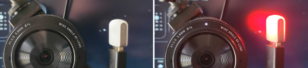

# LiveWebCam

## Realtime, "tally light" detection for video devices on MacOS & Linux

This python app detects when any video device activates or deactivates on your Mac or Linux machine, and runs any custom script you specify on the state change.

You control the trigger scripts - turn on a wifi-controlled lamp, ping a Slack channel, send an email, pop a desktop alert, etc. Write your own actions and do anything you want.

My personal setup turns on a Blink(1) USB LED:


## Under the hood

This is a wxPython menu bar / system tray tool that watches for webcam activity and runs your own scripts when the camera goes on or off. On **Linux** it uses the `uvcvideo` kernel module use count (same idea as the original). On **macOS** it uses an `lsof`-based heuristic (notably `USBVDC` / `AppleCamera` / related patterns, with CoreMediaIO bundle mmap noise filtered out).

## Quick install (recommended)

**Requirements:** Python **3.9+** and a working C toolchain if pip must build [wxPython](https://wxpython.org/) wheels (macOS/Windows usually get prebuilt wheels).

1. **Easiest for end users — [pipx](https://pipx.pypa.io/)** (isolated app + dependencies):

   ```bash
   pipx install /path/to/livewebcam
   ```

   Or from a clone at the repo root:

   ```bash
   make install-pipx
   ```

   Then run `livewebcam` (ensure `~/.local/bin` is on your `PATH`).

2. **One script** — uses pipx if installed, otherwise creates `./.venv` in the repo:

   ```bash
   chmod +x install.sh   # once
   ./install.sh
   ```

3. **Developers** — editable install in your own venv:

   ```bash
   cd /path/to/livewebcam
   python3 -m venv .venv
   source .venv/bin/activate   # Windows: .venv\Scripts\activate
   pip install -U pip setuptools wheel
   pip install -e .
   ```

   Some macOS Python builds create venvs **without pip**. If `python -m pip` fails with `No module named pip`:

   ```bash
   python -m ensurepip --upgrade
   python -m pip install --upgrade pip setuptools wheel
   ```

   Editable installs need **pip ≥ 21.3** (PEP 660). On Linux, you can use distro `python3-wxpython4` instead of the PyPI wheel if you prefer.

**Optional hooks** (blink1, etc.): after install, copy the example scripts into `~/bin` and make them executable (see [Hooks](#hooks)).

## Run

```bash
livewebcam
```

**Logging:** By default, **INFO** logs go to **stderr** (startup checks, hook runs, state changes, and a **heartbeat every 30 polls**). For **every-poll detail** (including `lsof` match lines on macOS):

```bash
LIVEWEBCAM_DEBUG=1 livewebcam
# or
livewebcam --debug
```

If you launch from Finder and have **no terminal**, write logs to a file:

```bash
livewebcam --debug --logfile ~/Library/Logs/livewebcam.log
```

**macOS detection:** The menu app uses the same **hybrid** strategy as `scripts/camera_probe_macos.py --method both` by default: **unified log + `lsof`**, combined with **OR** (either can report active). The standalone probe defaulted to **both**; the app previously defaulted to **`lsof` only** unless you set `LIVEWEBCAM_MACOS_USE_LOG=1`, which is why matches disappeared. Set `LIVEWEBCAM_MACOS_USE_LOG=0` only if you want **`lsof` alone**. If `lsof` still shows `match_count=0` while the camera is on, grant **Full Disk Access** to Terminal (or the Python / `livewebcam` binary) under **System Settings → Privacy & Security**.

Or from a checkout **without** `pip install -e .` (install wxPython only, then run from source):

```bash
pip install 'wxpython>=4.2'
PYTHONPATH=/path/to/livewebcam python3 -m livewebcam
```

The app shows a **pill-shaped menu bar / tray label** with small text: **“webcam OFF”** (muted) when idle and **“webcam ON”** (red) when the camera is thought to be active. The tooltip matches the label.

**Terminal output:** If you start the app from **Terminal** (`livewebcam` or `python3 -m livewebcam`), activation/deactivation lines and errors are printed to **stderr**. There is no log window when you launch from Finder, Spotlight, or Login Items.

**Menu bar on macOS:** The system may still treat the image as a **template** in some configurations, which can affect colors. The **ON/OFF** text keeps the two states easy to tell apart.

## Hooks

If these files exist **and are executable**, they are run on transitions:

| Event | Script |
|--------|--------|
| Camera becomes active | `~/bin/webcam_activated.sh` |
| Camera becomes inactive | `~/bin/webcam_deactivated.sh` |

Create `~/bin` if it does not exist, then copy and make executable:

```bash
mkdir -p ~/bin
cp examples/webcam_activated.sh examples/webcam_deactivated.sh ~/bin/
chmod +x ~/bin/webcam_activated.sh ~/bin/webcam_deactivated.sh
```

Adjust scripts as needed. Example [`examples/webcam_activated.sh`](examples/webcam_activated.sh) calls [`blink1-tool`](https://formulae.brew.sh/formula/blink1) (install with `brew install blink1` on macOS, or place the binary in [`bin/`](bin/README.md) and add that directory to `PATH`).

**Security:** only put scripts you trust in `~/bin`.

## macOS notes

- Detection is **heuristic**. If you need extra signal, set `LIVEWEBCAM_MACOS_USE_LOG=1` before starting to combine `lsof` with Unified Log events (see [`livewebcam/monitor_darwin.py`](livewebcam/monitor_darwin.py)).
- To tune patterns, use [`scripts/camera_probe_macos.py`](scripts/camera_probe_macos.py) (requires the package on `PYTHONPATH`, e.g. after `pip install -e .`).
